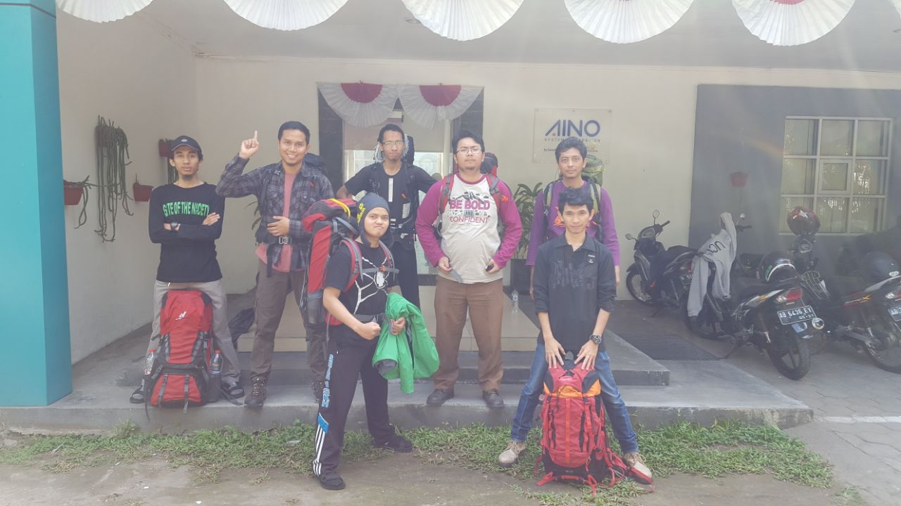
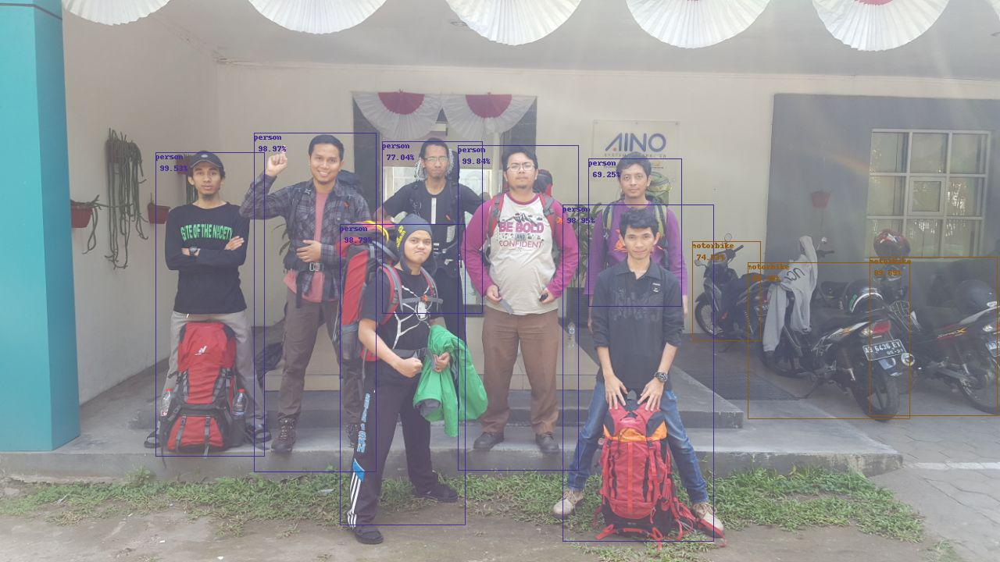

# tensorflow-yolo-v3-pi
Sample application openvino using YOLO V3

## How to running application
* `wget https://raw.githubusercontent.com/pjreddie/darknet/master/data/coco.names`
* `wget https://pjreddie.com/media/files/yolov3.weights`
* `wget https://pjreddie.com/media/files/yolov3-tiny.weights` (optional)
* `python3 ./convert_weights_pb.py --data_format NHWC` (optional)
* `python3 ./convert_weights.py --data_format NHWC`
* `python3 demo.py --input_img ~/Desktop/OpenVINO-YOLO3-input.jpeg --output_img ~/Desktop/OpenVINO-YOLO3-output.jpeg --data_format NHWC`

## Convert Model YOLO V3 to Model Inference
In this step must openvino installed in your pc/laptop
* `cd /opt/intel/openvino/deployment_tools/model_optimizer`
* `/mo_tf.py --input_model ~/PycharmProjects/tensorflow-yolo-v3-pi/frozen_darknet_yolov3_model.pb --tensorflow_use_custom_operations_config ../../deployment_tools/model_optimizer/extensions/front/tf/yolo_v3.json -o ~/PycharmProjects/tensorflow-yolo-v3-pi --data_type FP16 --batch 1`

## Running Model Inference in Raspberry Pi 3B+ using NCS2
* `python3 openvino_yolov3.py -d MYRIAD -i frozen_darknet_yolov3_model.xml`

